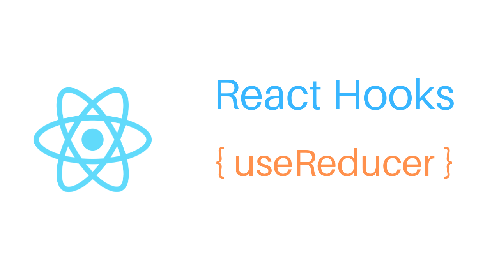

Lorem ipsum, dolor sit amet consectetur adipisicing elit. Totam ipsam expedita voluptatem quae, placeat obcaecati consequatur deleniti sint vero impedit nostrum debitis, soluta quas eaque nihil exercitationem. Odit, quos nesciunt

<iframe width="676" height="374" src="https://www.youtube.com/embed/O_PYNvk5hdM" frameborder="0" allowfullscreen></iframe>
